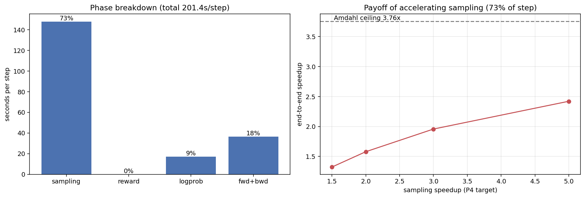
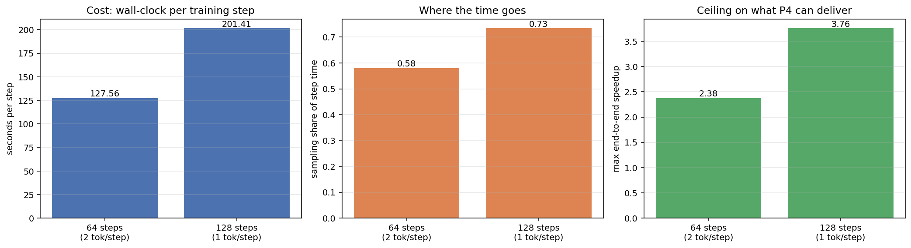
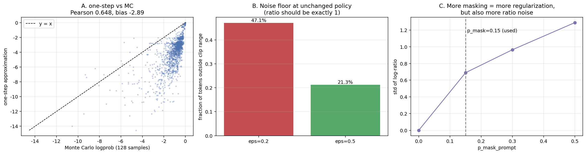

# diffu-GRPO / Fast-dLLM：给扩散语言模型的 RL 循环做采样加速，并量化它的代价

在 **LLaDA-8B-Instruct** 上跑 diffu-GRPO 训 Countdown，把 **Fast-dLLM** 的块级 KV cache
与置信度并行解码接进 rollout，测清楚"采样变快"和"采样分布被改坏"之间怎么换。
单张 A100 40GB，全流程手写，不复用 TRL 的 GRPOTrainer。

---

## 1. 为什么做这个题

扩散语言模型的 RL 后训练卡在一个很具体的地方。每走一步策略更新，学生要先自己 rollout
一批补全，而扩散解码是逐轮去噪，一条 128 token 的补全得做几十次全序列前向。
这不是常数开销，是乘在每一步上的。d1 的论文里把这件事写明了：在线生成太贵，
所以他们把生成长度限制在 256。

推理侧早就有现成的解法。Fast-dLLM 用块级 KV cache 复用，加一个置信度阈值一次解掉多个
token，training-free，在 LLaDA 上报到最高 27.6 倍吞吐。接进 rollout 看着是顺理成章的一步。

麻烦在于 RL 不是推理。policy gradient 要求 rollout 来自当前策略，而并行解码改的恰好是
采样分布——本来一轮定一个位置的条件分布，变成一轮同时定下好几个。时间是省了，
可拿回来的轨迹已经不是当前策略的样本了。diffu-GRPO 自己的 log-prob 又是个单步近似，
两层偏差叠在一起会怎么样，没人报过。

所以这个项目要测的是差值：省下多少墙钟时间，换来多少额外的 off-policy 偏差，
以及这笔交易在哪段配置区间里还划算。

**先说个已经测出来的坏消息。** A100 上实测，`diffusion_steps=64` 时采样只占单步的 58%，
按 Amdahl 算，就算采样快到无穷，端到端上限也只有 2.38 倍。原因是 64 步解 128 个 token
等于每步 2 个，基线本身已经在并行解码，Fast-dLLM 还能再榨的空间被压得很窄。
换成 d1 官方的 128 步，占比升到 73%、上限 3.76 倍，代价是单步从 128 秒涨到 201 秒。
P3 取后者：慢一倍，但天花板高一倍，这题才有得做。

## 2. 要回答的问题

| 阶段 | 问题 | 状态 |
| --- | --- | --- |
| P1 | 单步时间花在哪，采样究竟占多少，加速的收益上限是多少 | 已测 |
| P2 | diffu-GRPO 的地基是单步 log-prob 近似，它到底差多少 | 已测 |
| P3 | 把 Fast-dLLM 的 KV cache 与置信度并行解码接进 rollout | 在做 |
| P4 | 加速带来的额外 off-policy 偏差有多大，安全区间在哪 | 待做 |
| P5 | 同等墙钟时间下的 reward 曲线对比，加 GSM8K 回归检查 | 待做 |

P2 是这里面最值得单独做的一个。d1 的估计方式是把整段补全替换成掩码，做一次前向，
在每个位置上读出目标 token 的 log-prob。真值要对掩码比例做蒙特卡洛，
LLaDA 官方用 128 个样本，论文提了这对在线 RL 太贵，却始终没报过单步近似和它差多少。
clip 范围 ε 为什么必须从常见的 0.2 放宽到 0.5，答案就藏在这个偏差里，下面第 3 节有实测。

## 3. P1/P2 实测

A100 40GB，图和原始数据在 [figures/](figures)。

- 采样占单步 58%（64 步）/ 73%（128 步），Amdahl 上限 2.38 倍 / 3.76 倍
- 两档的实测占比都比按前向次数算的理论预算高 5 到 6 个百分点。那几个点是重掩码逐行
  簿记里的 GPU 到 CPU 同步，不是模型计算，KV cache 吃不到，已改成整批取点
- 单步 log-prob 比蒙特卡洛真值系统性偏低 2.89 nat，Pearson 0.65、Spearman 0.72。
  排序关系留得住，绝对值留不住，所以它能当 ratio 用、不能当 log-prob 读
- 策略一个字没改时 ratio 本该恒等于 1，实测 log-ratio 标准差 0.63，ε 取 0.2 时
  47% 的 token 落在 clip 区外，ε 取 0.5 降到 21%。d1 放宽 ε 不是调参，是被这个噪声逼的
- prompt 掩码比例 0 / 0.15 / 0.3 / 0.5 对应 log-ratio 标准差 0 / 0.69 / 0.96 / 1.29。
  正则强度和 ratio 噪声是同一个旋钮的两头，选 0.15 是在这条曲线的拐点前
- 七到九成补全撞在 128 的长度上限上（eos 命中率只有 0.08 到 0.29）。正确率 0.16 里
  有多少是推理不行、有多少是答案没写完，现在分不开，这是 P3 前要先测掉的







## 4. 实验设置

- 模型 LLaDA-8B-Instruct，bfloat16，LoRA `r=128` / `alpha=64`，可训练 3.36 亿参数
- 任务 Countdown，自己合成并去重，奖励拆成格式与正确性两项，表达式走 AST 白名单求值
- 采样 `block_length=32`、`diffusion_steps=64`、`max_completion_length=128`、`low_confidence` 重掩码
- GRPO `num_iterations=12`、`epsilon=0.5`、`beta=0.04`、`p_mask_prompt=0.15`，每步 4 道题 × 6 条 rollout
- 优化 `lr=3e-6`、`adam_beta2=0.99`、`max_grad_norm=0.2`、`max_steps=200`，反向按 4 条一微批累积

刻意偏离 d1 官方配置的地方逐项列在 [plan](docs/plan-diffu-grpo.md) 第 2 节，都带理由。

## 5. 工程实现要点

不调库有一半原因是 TRL 的 GRPOTrainer 采样是给自回归模型写的，套扩散采样要大幅覆写。
另一半是下面这些东西调库时全被藏住，而它们直接决定这套代码训得对不对。

**d1 的 LoRA 实际只挂上了 4/7。** LLaDA 的线性层沿用 OLMo 的命名，注意力输出投影叫
`attn_out`，FFN 两端叫 `ff_proj` 和 `ff_out`。d1 的配置里填的是 Llama 那套
`o_proj` / `gate_proj` / `down_proj`，一个都匹配不上。PEFT 只在全不命中时报错，
部分命中就静默跳过，于是官方真正训到的只有 `q` / `k` / `v` / `up_proj`，
注意力输出和整个 FFN 都没动。本项目按它的意图补齐，可训练参数因此是官方实测值的两倍
（1.68 亿变 3.36 亿）。要严格对齐官方基线，把目标模块改回那四个就行。

**词表投影和 FFN 下投影同名。** LLaDA 关掉 weight tying 时，词表投影叫
`transformer.ff_out`，和每个块里的 `blocks.N.ff_out` 末段一模一样。PEFT 按末段匹配，
目标模块写 `ff_out` 就会把那个 `[d_model, vocab]` 的大矩阵一起挂上适配器，
r=128 时凭空多出一千七百万可训练参数，而且训的是输出分布本身，跟低秩适配是两回事。
排除它必须用全匹配正则，不能用名字列表：PEFT 的排除也是按末段匹配的，
列表里填 `ff_out` 会把每个块的下投影一并排掉，等于 FFN 压根没挂适配器，还悄无声息。

**LLaDA 的 attention_mask 传了等于没传。** `LLaDAModel.forward` 把 mask 算成加性 bias 之后
紧跟一行就把它置回 None。真实 token 会注意到 padding，补全质量被系统性拉低。
这不是本项目的 bug，也不打算修：d1 同样如此，保持一致才可比。补齐到固定长度让每行的
padding 量只由自身 prompt 长度决定，可复现性不受影响。加载时有一项自检把这个差异打出来，
避免以后有人误以为是自己写坏了。

**attention 实现只能填 eager。** `LLaDAModelLM` 是 trust_remote_code 加载的自定义架构，
没声明支持 sdpa，HF 的 dispatch 一律拒绝，填 `sdpa` 直接抛 ValueError。这个值实际上跟性能
无关：LLaDA 的远端代码自己就在调 `F.scaled_dot_product_attention`，走什么核由它决定，
填 eager 只是把 HF 的 dispatch 让开，顺带省掉 flash-attn 在 Colab 上二十分钟的编译。

**采样期的显存大头不是权重，是噪声。** Gumbel 采样原来在整条序列的全词表上做，
`torch.rand` 默认 fp32，一个临时张量就是 2.89GB，而照数学式子直写一步内会同时活着五六个，
峰值十几个 GB。实际上块外的位置从头到尾都被 -inf 屏蔽、永远不会被采纳，
切到当前块上就是 8 倍，再把整条运算改成原地，只剩一个张量。这个 bug 的症状很有迷惑性：
预热步能过，第二步才 OOM，因为 AdamW 的动量是第一次 step 时才惰性分配的。

**微批累积能成立是靠归一化方式。** 单卡放不下整批 24 条的激活，四十多 GB。
拆成 4 条一微批累积梯度，和一次算完整批是逐位相等而不是近似，前提是 grpo_loss
先按每条序列自己的 token 数归一化、再对批取平均。哪天有人把它改成按全批 token 总数平均，
等价性就悄悄没了，训练照跑但梯度是错的，所以专门留了一条测试盯着。没选
activation checkpointing 是因为它反向要多跑一遍前向，会直接改掉 P1 要测的耗时占比。

**三次 log-prob 估计必须共享同一个掩码模式。** 论文式 4 里 prompt 掩码 q' 位于期望之内，
θ、θ_old、θ_ref 三次估计要用同一个 q'，每次内更新之间才重新采。写成各自采一次也能跑，
ratio 会多一层纯噪声，而且怎么看都看不出来。

**temperature=0 能让一整条测试变成空跑。** 这个我自己踩了。给微批等价性写测试时梯度一直
全零，起初以为是累积写错了，实际是测试配置里贪心解码，同组六条补全逐字节相同，
奖励没有方差，优势全零。断言在这种情况下永远成立，测试绿得毫无意义。
现在那条测试第一句就是断言优势不全零。

**防除零的 eps 把空转步藏了起来。** 优势按组内标准差归一化，分母加 `1e-4` 防除零。
实测第 4 步六条 rollout 奖励逐字节相同，整步该是空转，可 `zero_advantage_frac` 报 0。
原因是奖励值 0.2 落在 float32 上方一个 ULP，除以 6 除不尽，减完均值剩 2^-26 的舍入残差，
再除 eps 放大一万倍到 1.5e-4，比指标的 1e-8 判据高四个数量级。
组内奖励全同时得显式置零，靠 eps 兜是不够的。原来那条单测用的是 4 条 × 奖励 2.0，
两个数都除得尽、残差恰好为 0，所以一直是绿的——现在改成抄实测那组值。

**存盘按 Colab 一定会断来设计。** 阶段结果即时原子落盘，先写 `.tmp` 再 replace。
checkpoint 约 4GB 而 Drive 写入只有 10-20MB/s，所以本地每 25 步存一次救进程崩溃，
每 100 步镜像到 Drive 救会话断开，存盘耗时本身也记进指标。

CPU 上还有一个 tiny 模型做替身，结构照抄 LLaDA，连词表投影和 FFN 下投影重名这点都保留。
单测里用的 LoRA 目标模块和真实配置是同一份，适配器挂不上会在本地就炸，
不用烧几小时 A100 才发现。

## 6. 快速开始

```bash
conda env create -f environment.yml
conda activate dllm-dev
python -m scripts.check_env
python -m scripts.run_p1_profile --config configs/countdown_base.yaml --tiny --steps 2
python -m scripts.run_p2_logprob --config configs/countdown_base.yaml --tiny --mc-samples 16
```

脚本一律在仓库根目录以 `-m` 运行，直接跑 `python scripts/xxx.py` 时 sys.path 指向
`scripts/` 本身，`dllm` 会导入不到。`--tiny` 换上 CPU 小模型，输出的数字没有意义，
只用来验证接线。上 A100 就打开 `notebooks/colab_p1_p2.ipynb`，运行时选 A100。

## 7. 目录结构

```
src/dllm/
  config.py       超参 dataclass，不能改的项在注释里写明理由
  experiment.py   实验装配、单步算力预算、Amdahl 上限
  sampling/       块级扩散采样，Fast-dLLM 在这里接入
  logprob/        单步近似与蒙特卡洛真值，P2 的对照对象
  train/          GRPO 损失、三策略封装、训练循环、断点续训
  models/         llada.py 真实装配与自检，tiny.py CPU 替身
  data/           Countdown 合成
  rewards/        格式与正确性奖励，AST 安全求值
  utils/          分阶段计时、指标打点
scripts/          入口，一律 python -m scripts.xxx
notebooks/        Colab 入口，由 scripts/_build_notebook.py 生成
figures/          P1/P2 的图与原始数据，data/ 下是 json 与 csv
docs/             plan 是实施方案，proposals 是选型过程，lessons 是踩过的坑
```

## 8. 许可

Apache License 2.0，与 d1 一致。见 [LICENSE](LICENSE)。

## 9. 参考

- Zhao, Gupta, Zheng, Grover. *d1: Scaling Reasoning in Diffusion Large Language Models via
  Reinforcement Learning.* [arXiv:2504.12216](https://arxiv.org/abs/2504.12216)
- Wu, Zhang, Xue et al. *Fast-dLLM: Training-free Acceleration of Diffusion LLM by Enabling
  KV Cache and Parallel Decoding.* ICLR 2026.
  [arXiv:2505.22618](https://arxiv.org/abs/2505.22618)
- Nie et al. *Large Language Diffusion Models (LLaDA).*
  [arXiv:2502.09992](https://arxiv.org/abs/2502.09992)
